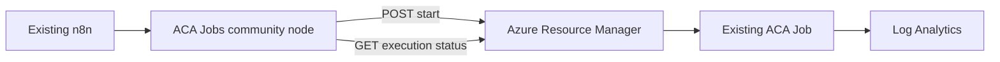

# n8n on Azure Container Apps Jobs

[](https://github.com/hetvip2/n8n-on-aca-jobs/actions/workflows/ci.yml)

Run existing Azure Container Apps (ACA) Jobs from an existing self-hosted n8n installation with native credentials, importable workflows, bounded ARM retries, and durable execution identity.

**Ownership boundary:** this is an existing-mode template. You continue to operate n8n, its database, workers, encryption key, ingress, and upgrades. `azd up` creates only a sample ACA Job, Container Apps environment, and Log Analytics workspace. It does not deploy n8n.



## Fit

Use this package when n8n should remain the workflow control plane and burstable or isolated work should run as manual ACA Jobs. Do not use it to deploy n8n, for sub-second tasks, or when the workload must run inside the n8n worker process.

## Prerequisites

- Self-hosted n8n `2.30.1` or a compatible `2.x` release
- Node.js `22.22` or `24` for package development
- Azure CLI and Azure Developer CLI for sample provisioning
- An existing manual-trigger ACA Job for production use

## Five-minute quickstart

Install and verify the package without Azure:

```powershell
npm ci --ignore-scripts
npm run check
npm run smoke:n8n
```

Linux/macOS:

```sh
npm ci --ignore-scripts
npm run check
sh scripts/smoke-n8n.sh
```

Install the built package into the same environment as self-hosted n8n:

```sh
npm run build
npm pack
cd /path/to/n8n
npm install /path/to/n8n-nodes-aca-jobs-0.1.0.tgz
```

Restart n8n, create an **Azure Container Apps Jobs** credential, and import `workflows/single-job.json` or `workflows/fan-out-fan-in.json`. Replace the placeholder credential reference through the n8n UI.

To create the sample Azure target, review the subscription and location first, then run:

```sh
az login
azd auth login
azd init
azd up
azd env get-values
```

`azd up` can create billable Azure resources. No deployment was run while preparing this repository.

## Local runtime validation

`npm run smoke:n8n` builds this package, loads it into a real n8n `2.30.1` CLI runtime, runs `workflows/local-smoke.json`, and exercises start plus `Running -> Succeeded` polling against a local ARM stub. Azure is not contacted. The static token and `ACA_JOBS_ARM_ENDPOINT` override exist only in this local smoke path.

## Run any workload

The node accepts subscription ID, resource group, job name, container name, command, arguments, environment entries, CPU, memory, poll interval, timeout, and correlation ID as n8n expressions. Leave **Overrides** empty to preserve every default in the ACA Job definition. Secret environment entries should use an existing ACA `secretRef`; never put secret values in workflow JSON.

The **Start** operation returns an execution name immediately. Persist that name in workflow data and use **Get Status** after an n8n Wait node for non-blocking polling. **Start and Wait** is simpler but occupies one n8n task slot while polling; its **Resume Execution Name** prevents a retry from starting a duplicate.

## Fan-out, retries, and durability

`workflows/fan-out-fan-in.json` creates 1-50 input items, starts one ACA execution per shard, and fails the final fan-in unless every configured shard succeeds. `ACA_JOB_SHARD_COUNT` controls the count and defaults to 5. Tune n8n worker concurrency, ACA job parallelism/quota, and polling intervals together.

## Production Concurrency

Set `ACA_JOB_SHARD_COUNT=25` on every n8n main and worker process that can execute the imported workflow, restart those processes, then invoke the workflow normally. Omit the variable for the five-shard default. Run `npm test -- fan-out-workflow` for executable evidence of default 5, configured 25, and the 1-50 bounds.

Live proof covers five-way fan-out only. The 25- and 50-shard configurations are supported by the workflow and tests but are unmeasured; validate them against the target n8n worker, ARM, and ACA quotas before production use. The client already sends `x-ms-client-request-id` on ARM requests, and its existing unit tests verify that behavior.

ARM `429`, `500`, `502`, `503`, `504`, and network failures use bounded exponential retry. `Retry-After` seconds or HTTP dates are honored up to 60 seconds. One `401` causes credential refresh; a second fails. Permanent `400`, `403`, and `404` responses are not retried. ACA `Failed`, `Canceled`, unknown states, malformed responses, and timeout become n8n node failures.

## Existing n8n integration

Community nodes execute inside n8n and must be installed on every main and worker process that may load or execute the workflow. Pin the package version and restart rolling workers after installation. Keep `N8N_ENCRYPTION_KEY` stable and use n8n's normal credential storage. Queue-mode users must install the package on workers as well as the main process.

## Authentication and least privilege

**Production:** choose **Managed Identity / Default Azure Credential**. Run n8n on Azure with a system-assigned or user-assigned managed identity. Grant only the actions needed to read the target job, start it, and read executions at the job resource scope. A custom role should include:

```json
{
  "actions": [
    "Microsoft.App/jobs/read",
    "Microsoft.App/jobs/start/action",
    "Microsoft.App/jobs/executions/read"
  ]
}
```

Verify exact custom-role actions against the current Microsoft.App provider operations in your tenant. Do not grant Contributor at subscription scope for production.

**Azure CLI / local development only:** choose **Azure CLI**, run `az login`, and let `AzureCliCredential` refresh tokens. This path is inappropriate for unattended production workers.

**Static access token / local smoke only:** tokens are short-lived and cannot be refreshed. Never save one in source, workflow JSON, logs, or environment files. The built-in smoke script uses a fake local token.

## Configuration reference

| Setting           |                    Default | Notes                                                        |
| ----------------- | -------------------------: | ------------------------------------------------------------ |
| API version       |               `2024-03-01` | Matches the local Airflow helper and Bicep resource contract |
| Poll interval     |                  5 seconds | Increase for large fan-out to reduce ARM traffic             |
| Execution timeout |               1800 seconds | Bounds n8n waiting; it does not cancel the ACA execution     |
| Network retries   |                          6 | Exponential backoff capped at 60 seconds                     |
| User-Agent        | `n8n-nodes-aca-jobs/0.1.0` | Enables adoption attribution                                 |

Cancellation propagation is not implemented because ACA Job execution cancellation semantics must be confirmed for the selected API and n8n cannot safely infer whether a shared execution should be stopped. Canceling n8n stops polling; inspect or stop the ACA execution independently.

## Testing and CI

`npm run check` runs Prettier check, ESLint, TypeScript, Vitest, build, and package-content validation. CI runs Node `22.22` and `24`, Bicep compilation, azd parsing, and the real local n8n runtime smoke without Azure credentials. Dedicated secret scanning and dependency auditing are publication gates.

## Validation status

Live validation in `westus2` completed an official n8n runtime workflow with exactly five independently matched `Succeeded` ACA executions. CI, clean-clone validation, dedicated secret scanning, dependency audit, independent review, idempotent provisioning, and cleanup are complete. Status: **LIVE VALIDATED**.

## Costs and production caveats

The sample creates Log Analytics and a Consumption Container Apps environment; usage and log ingestion can incur charges. ACA quotas, image pull time, workload identity, secret references, regional capacity, and n8n concurrency determine production behavior. Polling uses ARM requests and consumes an n8n task slot in **Start and Wait** mode.

## Troubleshooting

- `401 after token refresh`: verify managed identity availability, tenant context, and credential mode.
- `403`: verify role assignment scope and Microsoft.App job actions.
- `404`: verify subscription, resource group, job name, and cloud/tenant context.
- `429` or slow fan-out: increase poll interval and reduce n8n/ACA concurrency.
- Timeout: inspect the returned execution name in ACA; timeout does not imply cancellation.
- Node missing: install the package on every n8n process and restart it.
- Duplicate execution after retry: pass the previously returned name as **Resume Execution Name**, or use separate **Start** and **Get Status** nodes.

Errors intentionally exclude ARM bodies, authorization headers, static tokens, and environment values. Correlation IDs and execution names remain in outputs for diagnosis.

## Cleanup

Remove the sample resources and local smoke state:

```sh
azd down --purge
rm -rf .n8n-smoke
```

PowerShell:

```powershell
azd down --purge
Remove-Item .n8n-smoke -Recurse -Force -ErrorAction SilentlyContinue
```

## Project structure

- `nodes/` native n8n community node
- `credentials/` managed identity, Azure CLI, and local-token credential choices
- `src/` reusable ACA Jobs client and refreshable token strategy
- `workflows/` importable single-job, fan-out/fan-in, and local smoke workflows
- `infra/` sample ACA Job Bicep and azd hooks
- `scripts/` package validation and real n8n local-runtime smoke
- `test/` offline ARM contract tests

Licensed under Apache-2.0. See `LICENSE`.
